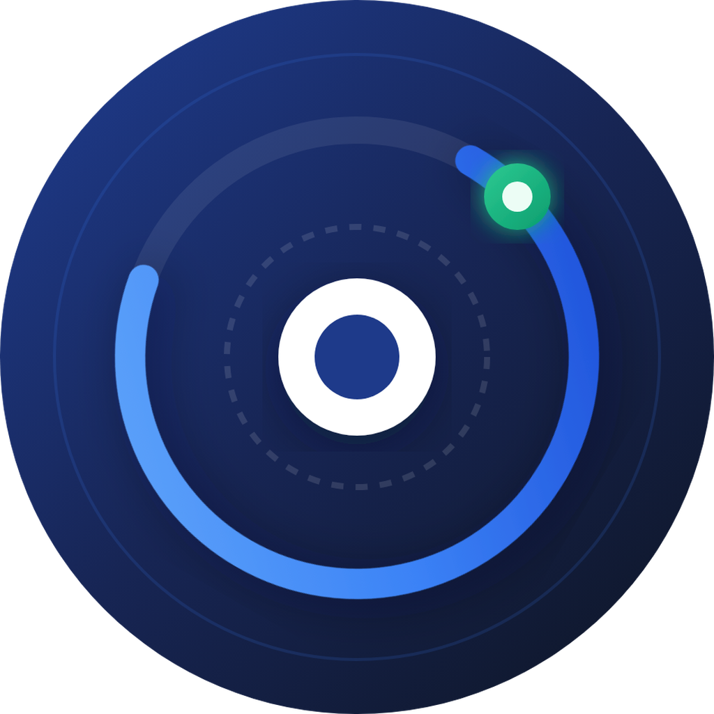
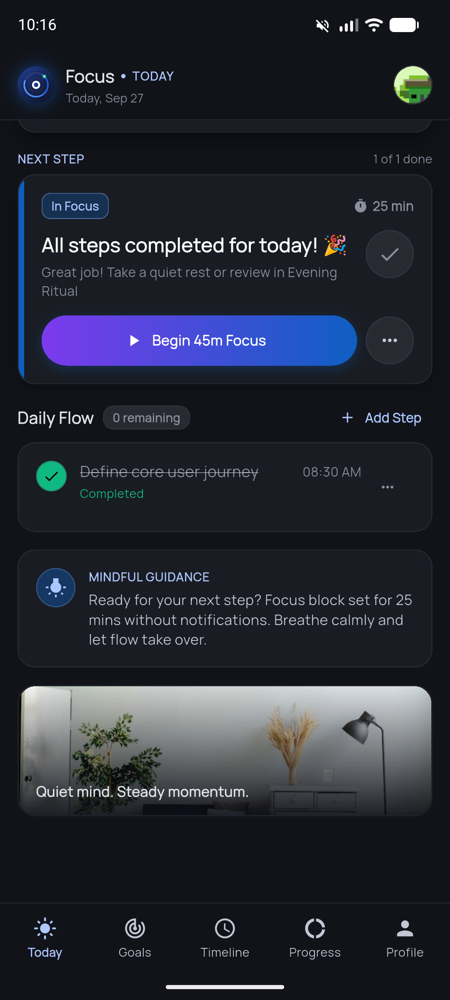
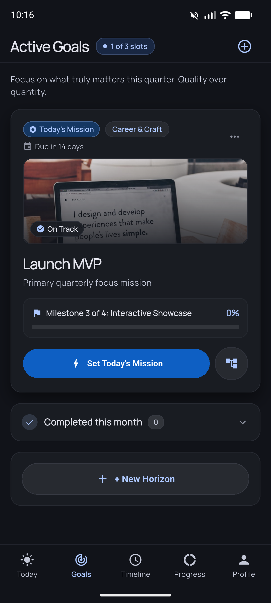
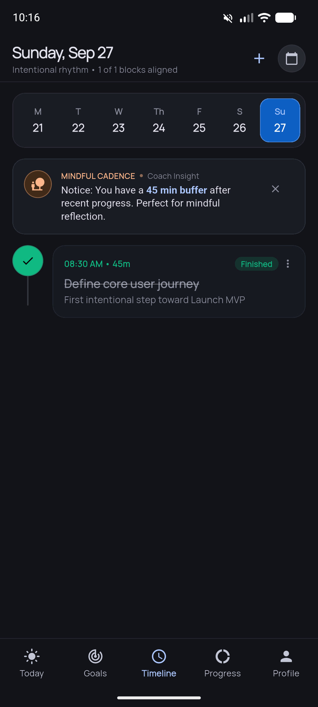
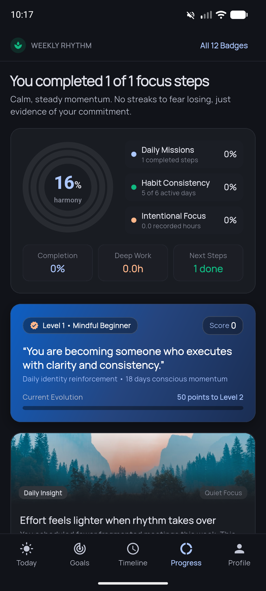
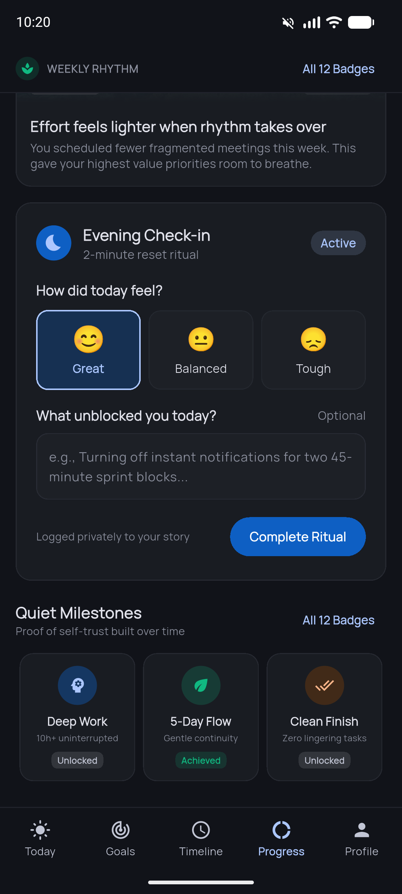
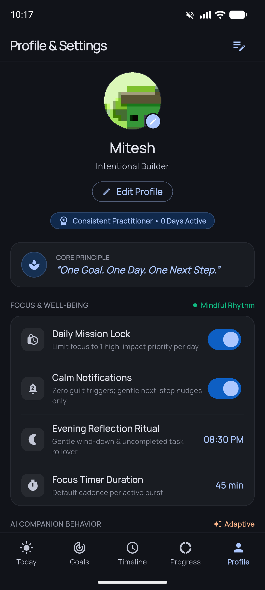

# OneGoal — Mindful Daily Goal Planner

<p align="center">
  
</p>

<p align="center">
  <strong>“One Goal. One Day. One Next Step.”</strong><br>
  An open-source, mindful productivity app engineered to feel like a calm personal coach rather than an overwhelming task manager.
</p>

<p align="center">
  <a href="https://github.com/miteshviras/onegoal/releases/latest/download/onegoal.apk">
    
  </a>
  &nbsp;&nbsp;
  <a href="https://github.com/miteshviras/onegoal/releases">
    
  </a>
</p>

<p align="center">
  <a href="https://flutter.dev"></a>
  <a href="https://dart.dev"></a>
  <a href="https://riverpod.dev"></a>
  <a href="LICENSE"></a>
  <a href="https://github.com/miteshviras/onegoal/pulls"></a>
  
</p>

---

## 🧘 Why OneGoal? (The Philosophy)

Traditional productivity systems trap users in an anxiety loop of infinite to-do lists, overdue badges, and fragile streaks. When life interrupts, falling behind creates shame and abandonment.

**OneGoal takes a behavioral-first approach:**
- **The Rule of One**: You accomplish more by completing **one intentional mission** every day than carrying forward twenty unfinished tasks.
- **Zero Guilt Triggers**: Uncompleted tasks roll forward gracefully during the Evening Reflection ritual with zero shame badges.
- **Cognitive Guardrails**: Active quarterly horizons are strictly capped at 3 slots to avoid burnout.
- **Proof of Self-Trust**: Progress is measured in calm consistency and quiet milestones rather than gamified points.

---

## 📱 App Screenshots

### Core Daily Rhythm
| Today's Mission | Active Horizons | Mindful Timeline |
| :---: | :---: | :---: |
|  |  |  |
| **Focus • Today**<br>Single daily priority, focus timer & guidance | **Active Horizons**<br>Cognitive 3-slot cap with milestone tracking | **Intentional Timeline**<br>Mini-week rhythm ribbon & smart buffers |

### Reflection & Calibration
| Concentric Progress Rings | Evening Reflection Ritual | Profile & Mindful Settings |
| :---: | :---: | :---: |
|  |  |  |
| **Harmony Rings**<br>Triple-ring metrics & identity reinforcement | **Evening Ritual**<br>Mindful 2-minute wind-down & reset check-in | **Calm Architecture**<br>Focus durations, companion tone & habits |

---

## 📥 Download & Install APK

Pre-built APKs are generated automatically using GitHub Actions CI/CD and published to GitHub Releases:

<p align="center">
  <a href="https://github.com/miteshviras/onegoal/releases/latest/download/onegoal.apk">
    
  </a>
  &nbsp;&nbsp;
  <a href="https://github.com/miteshviras/onegoal/releases">
    
  </a>
  &nbsp;&nbsp;
  <a href="https://github.com/miteshviras/onegoal/actions/workflows/build-apk.yml">
    
  </a>
</p>

### Where to Find the APK:
1. **Official Releases (Recommended):**
   - Download the latest signed/release build: **[`onegoal.apk`](https://github.com/miteshviras/onegoal/releases/latest/download/onegoal.apk)**
   - All versioned tags: [GitHub Releases Page](https://github.com/miteshviras/onegoal/releases)

2. **GitHub Actions CI Builds:**
   - Every push to `master` automatically triggers the **[Build & Release OneGoal APK](https://github.com/miteshviras/onegoal/actions/workflows/build-apk.yml)** workflow.
   - Built runner path: `build/app/outputs/flutter-apk/onegoal.apk`
   - Downloadable zip artifact: Under the run summary page at the bottom under **Artifacts** &rarr; **`onegoal-apk`**.

### How to Install:
1. **Direct on Android Device:**
   - Tap **[Download onegoal.apk](https://github.com/miteshviras/onegoal/releases/latest/download/onegoal.apk)** on your Android phone.
   - Open the downloaded file from your notifications or Downloads folder.
   - When prompted, grant permission to install from your browser/file manager.

2. **Via ADB (Wi-Fi or USB Debugging):**
   ```bash
   adb install -r onegoal.apk
   ```

---

## ✨ Features at a Glance

- **🎯 Today's Mission**: Center each day on a single high-impact initiative, broken down into manageable micro-steps.
- **⏱️ In-Focus Session**: Tactile focus timer (25m, 45m, 60m sprints) with live pause, resume, and haptic feedback.
- **📱 Live Android Home & Lock Screen Widget**: Native Android AppWidget with real-time countdown (`Chronometer`), single-tap pause/resume/finish controls, and seamless background-to-foreground state synchronization.
- **🧭 Active Horizons (3 Slots)**: Strict 3-goal limit that ensures deep focus on what truly matters this quarter.
- **📅 Mindful Timeline**: Mini-week rhythm ribbon, live time indicator, and coach buffer recommendations between sprints.
- **⭕ Concentric Progress Rings**: Triple concentric rings tracking Daily Missions, Habit Consistency, and Deep Work hours with a holistic Harmony score.
- **🌙 Evening Reflection Ritual**: 2-minute reset check-in with mood tracking, unblocking notes, and mindful journal logging.
- **🏅 Quiet Milestones**: Non-gamified proof of self-trust built steadily over time (Deep Work, 5-Day Flow, Clean Finish).
- **🌗 Fidelity Calm Theming**: High-contrast, battery-friendly Dark Graphite theme designed for focus and reduced eye strain.
- **💾 Local-First & Offline-Ready**: Full offline persistence via `SharedPreferences`, architected with clean repository abstractions ready for REST / backend synchronization.

---

## 🏗️ Architecture & Project Structure

OneGoal is built following **Clean Architecture** principles and powered by **Riverpod 3 Notifier** state management:

```text
lib/
├── core/
│   ├── constants/       # AppColors, palette definitions, styling constants
│   ├── services/        # StorageService, ApiService, LockscreenTimerService
│   └── theme/           # AppTheme configuration, Typography, Dark theme tokens
├── data/
│   ├── models/          # Goal, TaskItem, UserProfile, DailyReflection, QuietMilestone
│   └── repositories/    # GoalRepository, TaskRepository, ProgressRepository, UserRepository
└── presentation/
    ├── providers/       # Riverpod 3 NotifierProviders (UserProfile, Goals, Tasks, Progress)
    ├── screens/         # OnboardingScreen, TodayScreen, GoalsScreen, TimelineScreen, ProgressScreen, ProfileScreen
    └── widgets/         # Concentric Progress Rings Painter, Ritual Cards, Edit Profile Sheet, Avatars
```

---

## 🚀 Getting Started

### Prerequisites
- [Flutter SDK](https://docs.flutter.dev/get-started/install) (`>= 3.24.0` / Dart `>= 3.5.0`)
- Android Studio / Xcode / VS Code with Flutter extension
- An Android/iOS device, simulator, or desktop environment

### Installation

```bash
# 1. Clone the repository
git clone https://github.com/miteshviras/onegoal.git
cd onegoal

# 2. Install dependencies
flutter pub get

# 3. Run the application
flutter run
```

---

## 🧪 Quality & Testing

OneGoal is committed to robust test coverage and strict lint standards:

```bash
# Run static analysis
flutter analyze

# Run unit and widget test suite
flutter test

# Run end-to-end integration tests
flutter test integration_test/user_journey_test.dart
```

---

## 🤝 Contributing to OneGoal

OneGoal is **100% open-source** and welcomes contributions from developers, designers, and mindful productivity enthusiasts!

### How to Contribute:
1. **Fork the repository** on GitHub.
2. **Create a feature branch**:
   ```bash
   git checkout -b feature/mindful-soundscape
   ```
3. **Commit your changes**:
   ```bash
   git commit -m "feat: add ambient focus soundscapes"
   ```
4. **Push to your branch**:
   ```bash
   git push origin feature/mindful-soundscape
   ```
5. **Open a Pull Request** describing your additions and rationale.

Please ensure `flutter analyze` and `flutter test` pass cleanly before submitting your PR.

---

## 📄 License

This project is open-source software licensed under the [MIT License](LICENSE).

---

<p align="center">
  Built with clarity and care for focused builders worldwide. 🌿
</p>
